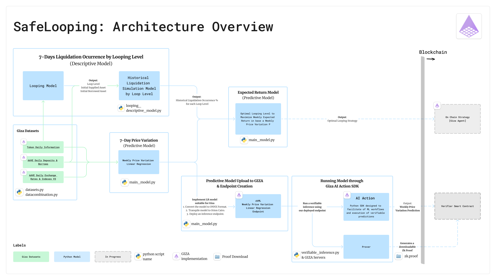

# 🔄 Safe Looping - Gizathon Project

> 📊 For an in-depth statistical and mathematical analysis of our model, please refer to our detailed paper in the ´stats&math` directory in this repo or [visualize it online here](https://drive.google.com/file/d/1ri0aJM6NtKeQ9-618xtHlU_hgucvGhk8/view?usp=sharing).

##  🗂️ Table of Contents

- [Leverage & Liquidations: The Defi Dance Off](#📝-leverage--liquidations-the-defi-dance-off)
    - [Context](#context)
    - [The Problem](#features)
    - [Why Is This Problem Worth Solving?](#why-is-this-problem-worth-solvin)
- [Our Proposal: Smarter & Safer Looping](#🌟-our-proposal-smarter--safer-looping)
    - [Description](#description)
    - [Model Assumption: Long ETH - Supplying ETH and borrowing USDC](#model-assumption-long-eth---supplying-eth-and-borrowing-usdc) 
    - [Model Architecture](#model-architecture)
    - [The Team: Blockchain, Data & Finance Lovers](#🚀-the-team-blockchain-data--finance-lovers)
    - [Giza Implementation Hightlights](#giza-implementation-highlights)
    - [Why Giza?](#why-giza)
    - [Modules Description](#modules-description)
        - [datasets.py](#1-datasetspy)
        - [data_combination.py](#2-data_combinationpy)
        - [looping_descriptivemodel.py](#3-looping_descriptive_modelpy)
        - [main_model.py](#4-main_modelpy)
        - [verifiable_inference.py](#5-verifiable_inferencepy)
- [Project Dependencies](#project-dependencies)
- [Next Step: On-chain Strategy](#next-steps-on-chain-strategy)
- [Contact](#contact)
- [Special Thanks](#📌--special-thanks)

 

## 📝 **Leverage & Liquidations: The DeFi Dance-Off**

DeFi investors are often tempted by the high returns of leveraging their positions by using looping strategies but are equally exposed to the threat of liquidations in a downturn market. 

This portrays the constant interplay between leveraging for higher gains and the threat of liquidation. In a dance-off, participants try to outperform each other with their moves. Similarly, investors are trying to outmaneuver the market by leveraging their positions for profit while avoiding the 'missteps' that lead to liquidation.

 

> ***🧠 The challenge lies in mastering these strategies to maximize gains while safeguarding against the volatile dips of the market.***

 

And this delicate balance is at the heart of the issues we are tackling.

SafeLooping's mission is to assist Defi investors in the path to sustainable investment by **calculating the optimal looping lever (leverage rate) for an expected weekly price variation**, by ensuring that profits don't come at the cost of security through an **expected return model that penalizes liquidation risk by leverage rate**.

## **📊 Context**

In the volatile world of DeFi, investors chase high returns, often embracing excessive risks. 

> 💡 A promising yet complex strategy that has emerged within this context is the use of "looping strategies." These strategies involve **reinvesting borrowed assets back into lending platforms to create a leverage loop**, amplifying the potential returns on the initial capital.

Amidst rising bullish sentiment, over-optimism leads to over-leverage, setting the stage for familiar pitfalls.

> “The volume of loans liquidated on Ethereum lending markets **has hit its highest monthly value since June 2022** (Terra crash)**, despite April not even being half over.”** - *[The Block Data](https://www.theblock.co/post/288212/aprils-first-two-weeks-saw-more-ethereum-loans-liquidated-than-any-month-since-june-2022)*
> 
**Lending markets**, crucial in this leverage play, facilitate strategies that magnify returns through **deposit and borrow _"loops"_**.

 However, the allure of these looping strategies comes with heightened risks of liquidation.

## ❓ Problem

The central problem this model aim to address is:

> ***What is the optimal looping strategy that maximizes expected returns while mitigating the risk of liquidation?***

And this problem has mainly two rationales:

1. **Maximizing Returns:**
    - The efficient use of looping strategies can significantly increase the gains of DeFi participants. 
2. **Minimizing Liquidation Risk:**
    - Pursuing higher returns inherently involves greater risks, particularly in a market known for its volatility where collateral values can plummet rapidly. 
    
 The critical element is **identifying the optimal number of loops to achieve maximum yield if price prediction over a period is bullish, without getting liquidated** by market volatility while position is opened.

## 🤔 **Why Is This Problem Worth Solving?**

Addressing this problem is important for several reasons:

- **Democratizing Access to Advanced DeFi Strategies & Leverage Risk**
    - By simplifying and automating the execution of analysis for looping strategies, this model aims to ***make advanced yield optimization techniques accessible to a broader audience***, not just to sophisticated or institutional investors with the resources and expertise to navigate these complexities with complex quant models.
    - By showcasing liquidation occurrence probability, ***we aim to educate people to take more responsible financial decisions***. 
    
     

- **Fostering Innovation in Financial Engineering:**
    - The development of a looping strategy optimization model represents a leap forward in financial engineering within the blockchain space. **It showcases the potential for innovative algorithms and mathematical models to solve complex financial challenges**, using blockchain available data in investors favor.

 

## 🌟 **Our Proposal: Smarter & Safer Looping**

      

### **Description**

Safe Looping is an innovative solution designed to address the inherent challenges of leveraging strategies in the DeFi ecosystem. In a volatile market where investors seek to maximize returns, our platform offers a comprehensive approach to optimizing looping strategies, which involve reinvesting borrowed assets to amplify gains. By leveraging statistical analysis and advanced mathematical models, Safe Looping calculates the optimal level of leverage to maximize expected returns while mitigating the risk of liquidation.

#### **Model Assumption: Long ETH - Supplying ETH and borrowing USDC**

To streamline our analysis and enhance the clarity of our model, we have assumed the use of the ETH-USDC pair as a primary example. This decision serves as a simplification to focus our predictive modeling and strategy development efforts effectively. Utilizing the ETH-USDC pair allows us to maintain consistency and precision in our simulations and forecasts, thereby providing a solid foundation for evaluating our financial strategies within a controlled and simplified environment.

### **Model Architecture**

You can find a intro video explaining the [model architecture here.](https://www.loom.com/share/b935ad3d66bf49f68b403dabe14870ea?sid=31ce36cb-6144-44e5-86e3-f3bb2fa47bbd)

## **🚀 The Team: Blockchain, Data & Finance Lovers**

We are passionate about blockchain, data analytics, and financial systems. Our team is comprised of experts who specialize in various aspects of blockchain technology, decentralized finance, and data science. Learn more about each of our team members below:

### Matias Rodriguez Pisani
**Python Ninja - Liquidation & Snipping Bot DeFi Maker**  
Matias specializes in developing sophisticated liquidation and sniping bots for DeFi platforms. His expertise in Python and blockchain technology drives our project's technical solutions.  

🔗 [LinkedIn Profile](https://www.linkedin.com/in/rodriguezmatid/)

### Tomas Moreno
**Yield Hunter - Lending & Collateral Product Manager**  
With a keen focus on maximizing yields and optimizing collateral management, Tomas brings a wealth of knowledge in managing lending products effectively. 

🔗 [LinkedIn Profile](https://www.linkedin.com/in/tomaspm/)

### Ceferino Pettovello
**Data Wizard - Decision Analytics Senior Associate**  
Ceferino is our go-to expert for all things data. With extensive experience in decision analytics, he ensures our data strategies align with our objectives and drive meaningful insights.  

🔗 [LinkedIn Profile](https://www.linkedin.com/in/ceferinopettovello7/)

## **Giza Implementation Highlights**

- **Giza Datasets** 
    - [Tokens Daily Information](https://datasets.gizatech.xyz/hub/aggregated-datasets/tokens-daily-information)
    - [AAVE Daily Deposits & Borrows](https://datasets.gizatech.xyz/hub/aave/daily-deposits-and-borrows-v3)
    - [AAVE Daily Exchange Rates & Indexes](https://datasets.gizatech.xyz/hub/aave/daily-exchange-rates-and-indexes-v3)

- **Inference Endpoint Deployment**
- **AI Actions**
- **zk-Proof Generation**
- Giza Agent _(coming soon)_

## Why Giza?

#### ***1. Accessible, Quality-Assured Datasets***
Giza Datasets open the door to an enriched pool of structured and curated blockchain data, vital for any linear regression. By providing open-sourced datasets, Giza addresses one of the critical challenges in blockchain analytics: the availability of high-quality data and keeping that data updated

#### ***2. Computational Efficiency in Asymmetric Environments***
 The GIZA platform provides an environment where the asymmetry in computational efficiency is pronounced — for instance, between blockchain computations and off-chain computations.

#### ***3. Cost & Development Effectiveness***
 Giza provides the structure and support for the execution of verifiable machine learning models. Computational tasks like proof generation are typically more resource-intensive than inference or proof verification. GIZA offers the infrastructure to perform these intensive tasks more efficiently, without the need to develop them ourselves.

## Modules Description

### 1. `datasets.py`

This module is responsible for loading all datasets downloaded from Giza.

#### Key Components:
- **Data Import:** Load multiple datasets into the Python environment.
- **Preprocessing:** Initial data cleaning and formatting.

### 2. `data_combination.py`

This script combines and preprocesses the loaded datasets to prepare them for analysis.

#### Key Components:
- **Data Merging:** Merge multiple datasets using specific filtering criteria.
- **Column Renaming and Sorting:** Rename and reorder dataset columns for uniformity and ease of analysis.
- **Calculation of Statistics:** Compute means, minimums, maximums, and moving averages for various financial metrics such as prices, volumes, deposits, borrows, and rates.
- **Date Filtering:** Focus on the dataset from January 27, 2023, to January 23, 2024, to match the availability of rate data for Aave. _This is a restriciont  that we made to match our model to giza datasets, as more data became available this restriction will not apply, making our model more robust._

### 3. `looping_descriptive_model.py`

This module includes several components that analyze the risk of liquidation based on different looping levels with cryptocurrencies.

#### Key Components:
1. **Looping Matrix:** Calculate the initial amounts of ETH and USDC based on the loop level.
2. **Liquidation 7 Day Check:** Monitor the collateral health over a 7-day period for various loop levels to identify potential risks.
3. **Liquidation Occurrence Matrix:** Map the frequency of liquidations starting from a specific day for each loop level.
4. **Liquidation Probability by Loop Level:** Estimate the percentage probability of liquidation for each loop level.

### 4. `main_model.py`

This script is central to our predictive analytics, encompassing several models designed to forecast financial metrics and optimize investment strategies based on data processed by previous modules. The functionalities are outlined below:

#### **4.1) 7-Day Price Variation Predictive Model**

This component utilizes a linear regression model to predict weekly price variations of cryptocurrencies. The model is trained on historical data to identify trends and forecast future price movements.

#### Key Processes:
- **Model Training:** Train a linear regression model on historical price data to predict 7-day price variations.
- **Data Analysis:** Analyze price trends to improve the accuracy of predictions.

#### **4.2) Predictive Model Deployment to GIZA & Endpoint Creation**

After training, the 7-Day Price Variation Predictive Model is prepared for deployment in a production environment.

#### Key Steps:
1. **ONNX Conversion:** Convert the trained linear regression model to the Open Neural Network Exchange (ONNX) format for interoperability.
2. **Transpilation to Orion Cairo:** Transpile the ONNX model into Orion Cairo, suitable for deployment on Giza's decentralized infrastructure.
3. **Endpoint Deployment:** Deploy an inference endpoint to facilitate real-time predictions.

#### Outcome:
- The deployment culminates in a zkML Weekly Price Variation Linear Regression Endpoint, enabling secure and scalable predictions.

#### **4.3) Expected Return Model**

This predictive model aims to optimize financial returns by calculating the optimal looping level based on the weekly expected return, influenced by predicted weekly price variations.

#### Inputs:
- **Looping Descriptive Model Output:** Utilizes output from `looping_descriptive_model.py`, providing data on different looping levels and their historical performance.
- **7-Day Price Variation Prediction:** Integrates forecasts from the 7-Day Price Variation Predictive Model to adjust return expectations based on predicted market movements.

#### Functionality:
- **Return Optimization:** Analyzes combined data to identify the looping level that maximizes expected returns based on predicted price variations.

### 5. `verifiable_inference.py`

This script is designed to interface with the deployed zkML Weekly Price Variation Linear Regression Endpoint via Giza's AI Action SDK. It enables the execution of verifiable inferences, providing both predictions and cryptographic proofs of the computation's integrity.In other words, this allows users to run verifiable inferences using our deployed linear regression model endpoint.

#### Key Processes:
- **Model Interaction:** Connect to the zkML Weekly Price Variation Linear Regression Endpoint.
- **Inference Execution:** Run the predictive model to forecast weekly price variations.
- **zk Proof Generation:** Automatically generate a downloadable zero-knowledge proof confirming the integrity of the inference process.

#### Outcome:
- Users receive a predicted weekly price variation along with a zk proof, which can be downloaded (*or used as an input on-chain --coming soon*) to verify the authenticity and correctness of the inference.

## Project Dependencies

- [**pandas**](https://pandas.pydata.org/)
- [**numpy**](https://numpy.org/)
- [**certifi**](https://pypi.org/project/certifi/)
- [**polars**](https://github.com/pola-rs/polars)
- [**matplotlib**](https://matplotlib.org/)
- [**seaborn**](https://seaborn.pydata.org/)
- [**giza_datasets**](https://gizatech.xyz/)
- [**sklearn (scikit-learn)**](https://scikit-learn.org/stable/)
- [**skl2onnx**](https://github.com/onnx/sklearn-onnx)
- [**giza_actions**](https://gizatech.xyz/)

## **Next Steps: On-Chain Strategy**

As we advance in our project, our next steps are  aimed at leveraging the outputs of our models and the zero-knowledge proofs to develop a robust on-chain strategy. This integration is critical for enhancing the reliability of our financial models in a decentralized environment.

### On-Chain Strategy Development
- **Model Outputs Utilization:** We plan to use the predictive outputs from our models directly on-chain to inform and optimize our investment strategies.
- **Zero-Knowledge Proofs Implementation:** By bringing zk proofs on-chain, we aim to ensure that all inferences executions are verifiable, adding an extra layer of security and trust without compromising efficiency.

### Research and Implementation
- **Studying Giza Agents:** We are currently exploring the capabilities of Giza Agents to determine how best to implement these advanced features. Giza Agents offer powerful tools for automating and executing complex tasks on-chain, which are essential for our strategy’s success.

## 📬 **Contact**

For support, inquiries, or contributions, please raise an issue directly in the GitHub repository and we will be happy to help & collaborate!

## 📌 ** Special Thanks **

We would like to express our deep appreciation to the **Giza Team**, especially to **Chachaleo and Ege**, for their  support and guidance throughout this process. Your expertise and dedication have been instrumental in our project's success and have greatly enriched our experience. Thank you for being such an integral part of our journey!

Additionally, we extend our heartfelt thanks to the **MuBuenos team** for organizing such an incredible space that has significantly fostered collaboration and innovation among all participants. Your efforts in creating this vibrant community are truly commendable.

